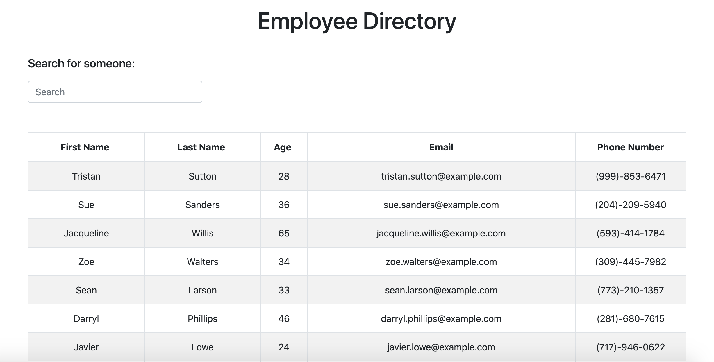

# Employee-Directory

## Description

With this Employee Directory App, the user will be able to view their entire employee directory at once so that they have quick access to their information. When the page is loaded, the information for all of their employees is populated onto the page. 

The user may sort the table by First Name, Last Name, or Age. It is also possible to search for any user in the table by First Name, Last Name, Age, Email or Phone Number. As you type and begin your search, the table will filter to show you the users whose information matches that which you've typed in. 

## Table of Contents

* [Project Summary](#description)
* [Preview](#preview)
* [Deployed App](#app)
* [Contact Me](#questions)
  
## Preview

Below are some example images of the app!

## App

Here is a link to the deployed app on Heroku: 
[Employee Directory App](https://boss-budgeting.herokuapp.com/)

## Questions?

If you have any questions, please don't hesitate to reach out!

Github: [habby-bit](https://github.com/habby-bit)
  
Email: [habbyolu@gmail.com](habbyolu@gmail.com)
